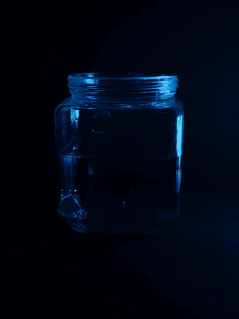

<html lang="en">
<head>

         <meta charset="utf-8">
         <title> 
                Divyanshu Sharma
         </title>
	
</head>

   

<body background="https://images.pexels.com/photos/844297/pexels-photo-844297.jpeg?cs=srgb&dl=pexels-eberhard-grossgasteiger-844297.jpg&fm=jpg">
  
           
          <h3 align="center">
              WELCOME
              

              
                 
             
              <h1 align="center">
          
              POEM 1
              <h3 align="center">
                  
                     
<b>The Container That Holds Me</b>

                                          
the container that holds me

                                         
 ohh I so want to escape it

                                           
 I ask you to open it

                                            
 open the container

                                              
I want to be free

											
it has been a long time

                                             
somebody caged me in

                                          
 now I see the outer world

                                          
 full of everything I want

                                          
 the darkness and emptiness

                                             
 ohh please free me 

                                          
I don't want to be inside

                                             
open the container

			   &nbsp; &nbsp; &nbsp; &nbsp; &nbsp; &nbsp; &nbsp; &nbsp; &nbsp; &nbsp;
			   &nbsp; &nbsp; &nbsp; &nbsp; &nbsp; &nbsp; &nbsp; &nbsp; &nbsp; &nbsp;
			  <b> STEADYDARK </b>
			   <h1 align="center">
          
              POEM 2
              <h3 align="center">
                  
			  
			  <b>Cuckoo And Happiness</b>
			  
Cuckoo is like my happiness
 

And spring shows its existence

 But the time is of winter

Never ending winter

 Or maybe I don't want it to end
 

The winter has become cuckoo's pleasure

Spring may Come back

Cuckoo may show that it exists

But i resist spring

This winter will remain forever

Cuckoo will cease to exist

The winter will never end

			   &nbsp; &nbsp; &nbsp; &nbsp; &nbsp; &nbsp; &nbsp; &nbsp; &nbsp; &nbsp;
			   &nbsp; &nbsp; &nbsp; &nbsp; &nbsp; &nbsp; &nbsp; &nbsp; &nbsp; &nbsp;
			  <b> STEADYDARK </b>
<h1 align="center">
          
              POEM 3
              <h3 align="center">
                  
			  <b> Be like that kid </b>
			

be like that kid who once wanted to put water on sun

just because he hated the heat

be like that kid who wanted to put the moon in his bag

just because he liked the stars

be like that kid who would

walk  barefoot

just because he thought shoes were precious.

be like that kid who smiled looking at strangers

just because he thought it was special

Just because he thought they were special

			   &nbsp; &nbsp; &nbsp; &nbsp; &nbsp; &nbsp; &nbsp; &nbsp; &nbsp; &nbsp;
			   &nbsp; &nbsp; &nbsp; &nbsp; &nbsp; &nbsp; &nbsp; &nbsp; &nbsp; &nbsp;
			  <b> STEADYDARK </b>

                  
              
         
       

          
     
